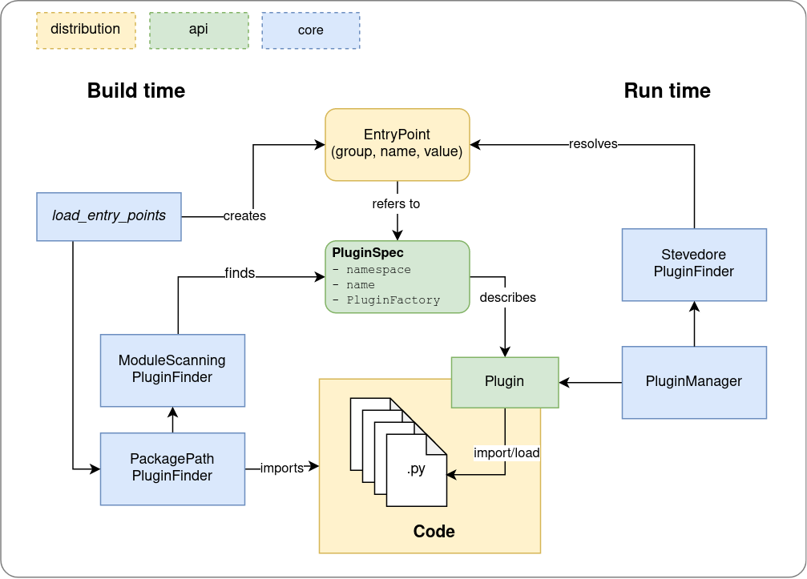

.. Plux documentation master file, created by
   sphinx-quickstart on Fri Jan 23 18:46:08 2026.
   You can adapt this file completely to your liking, but it should at least
   contain the root `toctree` directive.

Plux - Dynamic Code Loading Framework
=====================================

Plux is a plugin system for Python, and the dynamic code loading framework used in `LocalStack <https://github.com/localstack/localstack>`_. It builds a higher-level plugin mechanism around `Python's entry point mechanism <https://packaging.python.org/specifications/entry-points/>`_.

Plux provides tools to load plugins from Python entry points at run time, and to discover entry points from plugins at build time (so you don't have to declare entry points statically in your ``setup.cfg`` or ``pyproject.toml``).

.. toctree::
   :maxdepth: 1
   :caption: User Guide

   user_guide/quickstart
   user_guide/defining_loading_plugins
   user_guide/plugin_manager
   user_guide/filters
   user_guide/lifecycle_listener
   user_guide/build_integration
   user_guide/cli

.. toctree::
   :maxdepth: 1
   :caption: Reference

   reference/build_discovery
   reference/runtime_discovery
   reference/setuptools_integration

.. toctree::
   :maxdepth: 1
   :caption: Tutorials

   tutorials/index
